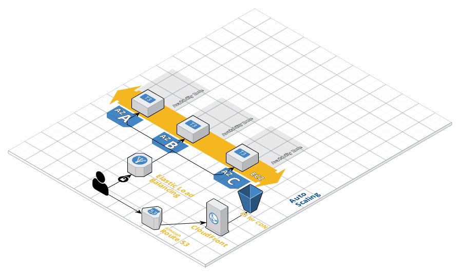

## Description

This project provides a solution for the `ops` code challenge by Lucky Day.  I set out to solve the following challenges:

- Orchestrate an HA cloud infrastructure in AWS with Terraform
- Configure the immutable AMIs with Ansible
- Configure and enforce SSL via an Elastic Load Balancer
- Provide a simple way to configure and deploy new versions of the app without downtime, to include swapping the health check message.

## Requirements

There are a few software and configuration requirements that must be met in order to deploy a working version of this solution.

### Software

The following software should be installed on your workstation

| Software                                                     | Version            | Purpose                                                      |
| ------------------------------------------------------------ | ------------------ | ------------------------------------------------------------ |
| [Ansible](https://docs.ansible.com/ansible/2.5/installation_guide/intro_installation.html) | 2.7                | Automated configuration of the compute resources             |
| [Packer](https://www.packer.io/downloads.html)               | 1.3.4              | Automated configuration of AMIs for application servers      |
| [Terraform](https://www.terraform.io/intro/getting-started/install.html) | 0.11.11            | Automated infrastructure orchestration                       |
| [dotnet core sdk](https://www.microsoft.com/net/download)    | 2.1.5              | To compile the sample application (for testing it locally if needed, otherwise this is compiled inside the AMI via packer/ansible) |
| vim                                                          | any recent version | used in the deploy scripts to edit any missing config files  |

### AWS Resources

In order to keep this project simple, the following global resources should be configured manually in AWS:

| AWS Resource Type | Purpose                                                      |
| ----------------- | ------------------------------------------------------------ |
| S3 Bucket         | This will be used as a remote backend for Terraform state.   |
| Route 53 DNS Zone | This will be the DNS Zone used to host the application and Terraform configuration will create the required records using the provided |

#### AWS Authentication

For the sake of simplicity, on your workstation an AWS credential file is expected here `~/.aws/credential` with the `default` profile configured to use the correct credentials for the target environment.  Ansible, Packer, and Terraform will use this file to authenticate.

### TL;DR; Quick Deployment and Teardown with Scripts

To enable easier testing, I've provided a set of scripts to make setup and teardown easy.  You will be prompted to provide any missing configuration settings.  In the instructions below the value `<version>` should be replaced with unique text to name the AMI created by Packer.  An easy convention is to use a build number e.g. 0.1.0, and increment it each time you perform a full deployment to ensure uniqueness.

The below steps will deploy the default app, perform a rolling update with the alternative text, and then destroy the resources.

1. Open the build directory in your shell `cd build`
2. Run the default deployment option with the following command:`./deployWithDefaults.sh "<version>"` .
3. When ready to test updates can deploy the alternate health message: `./deployWithOverrides.sh "<version>"`
4. At the end of the test, run the following command to cleanup the resources `./build/destroy.sh`

### How to deploy manually

Here's the steps to fully orchestrate and configure the solution, assuming all of the prerequisites have been met.

#### Terraform Variable Configuration

While there are a variety of ways to provide configuration data, using a variables file is the easiest option.  The user variables that are unique for each environment need to be specified in a `terraform.tfvars` file.  The `terraform.tfvars.sample` is provided as a template.  Note: the `terraform.tfvars` is ignored by git.

1. Make a copy of the sample file `cp terraform.tfvars.sample terraform.tfvars`
2. Edit the file, providing values for all of the variables.

#### Terraform S3 Backend Configuration

1. Make a copy of the sample backend config file `cp backend.config.sample backend.config`
2. Edit the new `backend.config` file with the values for your target s3 bucket and AWS region.
3. Now initialize terraform: `terraform init --backend-config=backend.config`

#### Build AMI and Deploy

1. Build and publish a new image via Packer: `cd infrastrastructure/packer && packer build -var ami_version=<version> webserver.json`  replacing `<version>` with the desired version number e.g. "0.1.0"
   - *Note*: For each image you publish the `ami_version` has to be unique, and specifying it here overrides the value in the `webserver.json` file, which is suitable for a CI/CD process.
2. Next create a terraform plan: `cd ../terraform && terraform plan -out=aws.plan`
3. After reviewing the plan, you can apply it to deploy the entire solution: `terraform apply aws.plan`
4. Terraform will configure the infrastructure.

You now have a fully configured, highly available web application.

#### Teardown the Infrastructure:

1. run `terraform destroy` and approve the plan.
2. Delete the S3 bucket and Route53 zone.
3. Delete the custom AMIs and their associated snapshots.

## A breakdown of how each goal was accomplished

I'd like to provide more informations on the choices I made while performing this work.

### Orchestrate an HA cloud infrastructure in AWS with Terraform

#### The following was configured:

- 1 Amazon Route 53 for DNS and automated SSL Verification
- 1 AWS Internet Gateway for the VPC
- 1 AWS ELB for load balancing across instances
- 1 VPC with 3 subnets, each in a different availability zone
- 3 EC2 Instances, each deployed to different availability zones via an Auto Scaling Group

Subnets:

| Network Address  | Broadcast Address | Availability Zone |
| ---------------- | ----------------- | ----------------- |
| 10.10.220.0/24   | 10.10.220.255     | n/a               |
| 10.10.220.0/26   | 10.10.220.63      | us-west-2a        |
| 10.10.220.64/26  | 10.10.220.127     | us-west-2b        |
| 10.10.220.128/26 | 10.10.220.191     | us-west-2c        |

### Configure the application servers with Ansible

Packer was used to configure immutable AMIs to simplify how the ASG provisions new ec2 instances.

Key aspects:

- Base AMI is based on centos7
- The `ansible-local` provisioner was used
- The sample application was made with `dotnet core 2.1`, which is compiled as a part of the ami provisioning process

### Configure and enforce SSL

- Leveraged Terraform to request, verify, and configure an SSL certificate at the ELB
- Configured nginx to enforce SSL by inspecting the forwarding HTTP headers.

### Provide an easy way to deploy updates

I've provided the following scripts that will build a new image and allows an override of the default health check text via a configuration value.

- `build/deployWithDefaults.sh`
- `build/deployWithOverride.sh`

### A couple things I didn't have time to do

- configure scaling policies for the ASG
- configure s3 and a CloudFront distribution for an image

